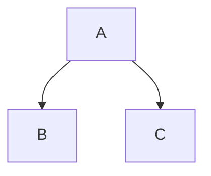

# Manual Básico de Markdown

**Markdown** es un lenguaje de marcado ligero que permite formatear texto de manera sencilla y rápida. Es ideal para redactar documentación, mensajes en foros, archivos `README`, o incluso escribir contenido para la web.  

---

## Índice

- [Manual Básico de Markdown](#manual-básico-de-markdown)
  - [Índice](#índice)
  - [¿Qué es Markdown?](#qué-es-markdown)
  - [Sintaxis Básica](#sintaxis-básica)
    - [Encabezados](#encabezados)
    - [Formato de texto](#formato-de-texto)
    - [Listas](#listas)
    - [Enlaces](#enlaces)
    - [Imágenes](#imágenes)
    - [Código](#código)
    - [Tablas](#tablas)
    - [Citas](#citas)
    - [Líneas horizontales](#líneas-horizontales)
  - [Sintaxis Extendida](#sintaxis-extendida)
    - [Listas de tareas](#listas-de-tareas)
    - [Diagramas (en GitHub con Mermaid)](#diagramas-en-github-con-mermaid)
  - [Ejemplos de Uso](#ejemplos-de-uso)

---

## ¿Qué es Markdown?

Markdown convierte texto plano en **HTML válido** usando símbolos sencillos como `#`, `*`, `-`, etc. Es fácil de leer incluso sin formato, lo que lo hace popular en plataformas como GitHub, Reddit o foros técnicos.  

**Ventajas**:

- Portabilidad: Funciona en cualquier editor de texto.  
- Simplicidad: No requiere conocimientos avanzados.  
- Compatibilidad: Se integra con HTML.
  
</br></br></br></br></br></br>

---

## Sintaxis Básica  

### Encabezados

Usa `#` para indicar títulos y subtítulos. Cuantos más `#`, menor el nivel del encabezado.  

```markdown
# Título Principal (h1)
## Subtítulo (h2)
### Sub-subtítulo (h3)
```

### Formato de texto

- **Negrita**: `**texto**` o `__texto__` → **Hola**.  
- *Cursiva*: `*texto*` o `_texto_` → *Hola*.  
- ~~Tachado~~: `~~texto~~` → ~~Hola~~.  

### Listas

**Listas desordenadas** (viñetas):

```markdown
- Elemento 1
- Elemento 2
  - Subelemento (indentado con 2 espacios)
```

**Listas ordenadas**:

```markdown
1. Primer elemento
2. Segundo elemento
```

### Enlaces

Sintaxis: `[Texto del enlace](URL)`.  
Ejemplo:

```markdown
[Google](https://www.google.com)
```

Resultado: [Google](https://www.google.com).  

</br></br></br></br></br>

### Imágenes

Sintaxis: ``.  
Ejemplo:

```markdown

```

### Código

**En línea**: Usa comillas invertidas (`` ` ``):

```markdown
El comando es `npm install`.
```

**Bloques de código**: Usa tres comillas invertidas (`` ``` ``) y opcionalmente especifica el lenguaje:

<pre>
```javascript
function saludo() {
  console.log("¡Hola!");
}
```
</pre>

### Tablas

Usa `|` para columnas y `-` para separar encabezados:

```markdown
| Nombre  | Edad |
|---------|------|
| Ana     | 25   |
| Pedro   | 30   |
```

Resultado:

| Nombre  | Edad |
|---------|------|
| Ana     | 25   |
| Pedro   | 30   |

</br></br></br></br></br>

### Citas

Usa `>` al inicio de la línea:

```markdown
> Esto es una cita inspiradora.
> — Autor
```

### Líneas horizontales

Usa tres guiones, asteriscos o guiones bajos:

```markdown
---
```

---

## Sintaxis Extendida

Algunas plataformas (como GitHub) soportan funciones adicionales:  

### Listas de tareas

```markdown
- [x] Tarea completada
- [ ] Tarea pendiente
```

### Diagramas (en GitHub con Mermaid)

<pre>

</pre>

---

## Ejemplos de Uso

**Documentación clara**:

```markdown
# Instalación  
1. Descarga el archivo:

   ```bash  
   wget https://ejemplo.com/app.zip  
   ```

2. **Importante**: Ejecuta `npm start`.
```


**Notas rápidas**:  
> ¡Recuerda!  
> - Usa `git commit -m "mensaje"`.  
> - ~~No olvides hacer pull.~~  

---

## Consejos y Mejores Prácticas  
1. **Mantén la consistencia**: Usa el mismo estilo de encabezados y listas.  
2. **Evita HTML**: A menos que necesites funcionalidad avanzada.  
3. **Espaciado**: Deja una línea en blanco entre elementos para mejor legibilidad.  
4. **Herramientas**: Usa editores como VS Code, Typora o StackEdit para previsualizar.  

---

¡Listo! Ahora puedes crear documentos bien estructurados, READMEs atractivos y colaborar eficientemente. Practica con [Markdown Live Preview](https://markdownlivepreview.com/) para ver resultados en tiempo real.  

```markdown
# ¡Empieza a usar Markdown hoy! ✨
```
