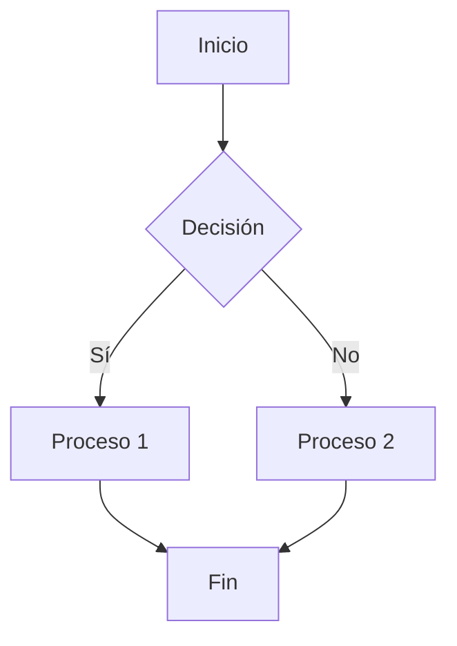
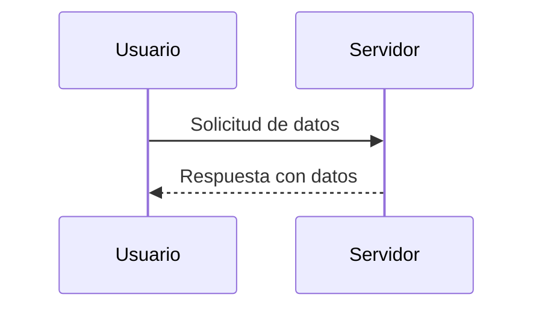
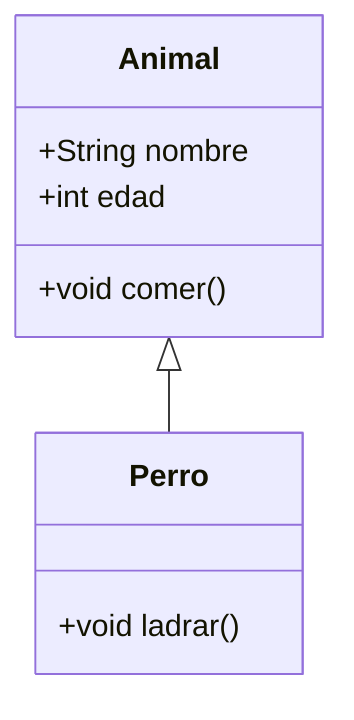
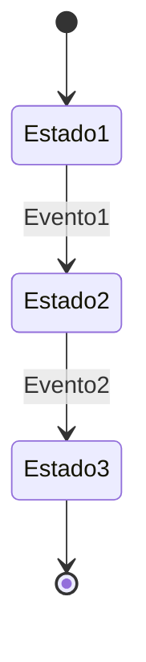
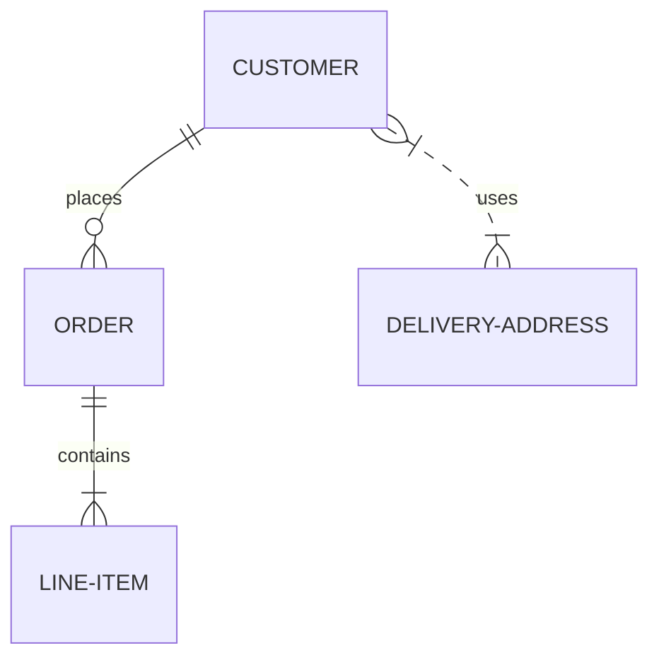
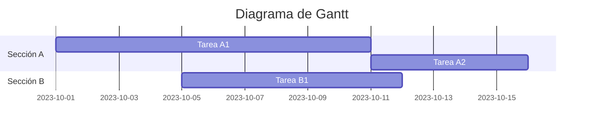
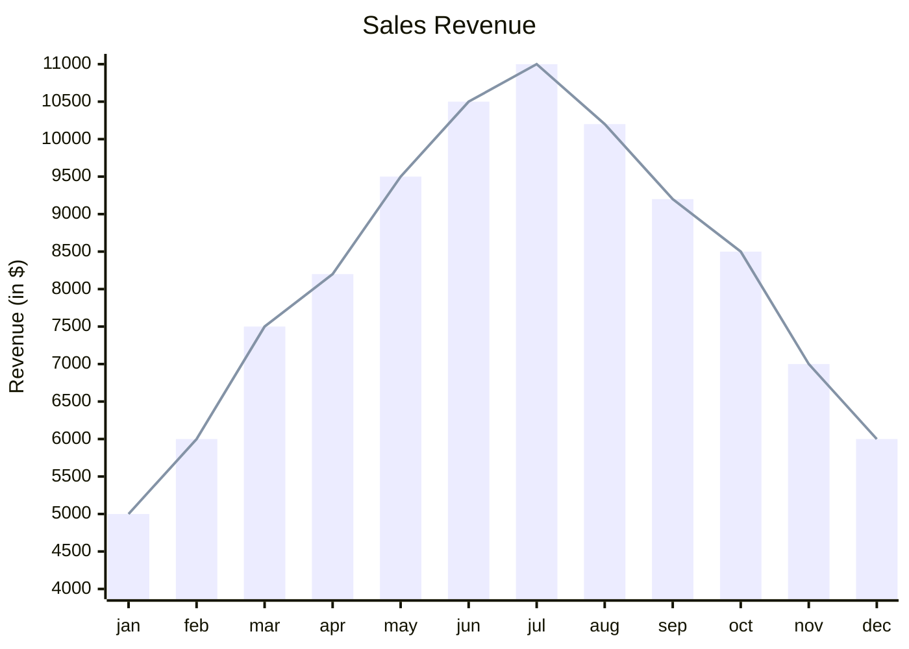
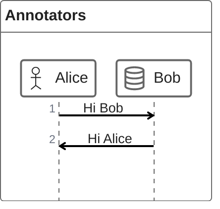

# Manual Básico de Markdown

**Markdown** es un lenguaje de marcado ligero que permite formatear texto de manera sencilla y rápida. Es ideal para redactar documentación, mensajes en foros, archivos `README`, o incluso escribir contenido para la web.  

---

## Índice

- [Manual Básico de Markdown](#manual-básico-de-markdown)
  - [Índice](#índice)
  - [¿Qué es Markdown?](#qué-es-markdown)
  - [Encabezados](#encabezados)
  - [Formato de texto](#formato-de-texto)
  - [Listas](#listas)
  - [Enlaces](#enlaces)
  - [Imágenes](#imágenes)
  - [Código](#código)
  - [Tablas](#tablas)
  - [Citas](#citas)
  - [Líneas horizontales](#líneas-horizontales)
  - [Sintaxis Extendida](#sintaxis-extendida)
    - [Listas de tareas](#listas-de-tareas)
    - [Notas rápidas](#notas-rápidas)
  - [Fórmulas en Markdown (Latex)](#fórmulas-en-markdown-latex)
    - [Fórmula en línea](#fórmula-en-línea)
    - [Fórmula en bloque](#fórmula-en-bloque)
    - [Fórmula más compleja](#fórmula-más-compleja)
  - [Diagramas (con Mermaid)](#diagramas-con-mermaid)
    - [1. Diagramas de Flujo](#1-diagramas-de-flujo)
      - [Ejemplo](#ejemplo)
    - [2. Diagramas de Secuencia](#2-diagramas-de-secuencia)
      - [Ejemplo](#ejemplo-1)
    - [3. Diagramas de Clase](#3-diagramas-de-clase)
      - [Ejemplo](#ejemplo-2)
    - [4. Diagramas de Estado](#4-diagramas-de-estado)
      - [Ejemplo](#ejemplo-3)
    - [5. Diagramas de Entidad-Relación (ER)](#5-diagramas-de-entidad-relación-er)
      - [Ejemplo](#ejemplo-4)
    - [6. Diagramas de Gantt](#6-diagramas-de-gantt)
      - [Ejemplo](#ejemplo-5)
    - [7. Gráficos Chart XY](#7-gráficos-chart-xy)
      - [Ejemplo](#ejemplo-6)
    - [8. ZenUML](#8-zenuml)
      - [Ejemplo](#ejemplo-7)
  - [Consejos y Mejores Prácticas](#consejos-y-mejores-prácticas)

---

## ¿Qué es Markdown?

Markdown convierte texto plano en **HTML válido** usando símbolos sencillos como `#`, `*`, `-`, etc. Es fácil de leer incluso sin formato, lo que lo hace popular en plataformas como GitHub, Reddit o foros técnicos.  

**Ventajas**:

- Portabilidad: Funciona en cualquier editor de texto.  
- Simplicidad: No requiere conocimientos avanzados.  
- Compatibilidad: Se integra con HTML.
  
---

## Encabezados

Usa `#` para indicar títulos y subtítulos. Cuantos más `#`, menor el nivel del encabezado.  

```markdown
# Título Principal (h1)
## Subtítulo (h2)
### Sub-subtítulo (h3)
```

## Formato de texto

- **Negrita**: `**texto**` o `__texto__` → **Hola**.  
- *Cursiva*: `*texto*` o `_texto_` → *Hola*.  
- ~~Tachado~~: `~~texto~~` → ~~Hola~~.  

## Listas

**Listas desordenadas** (viñetas):

```markdown
- Elemento 1
- Elemento 2
  - Sub-elemento (indentado con 2 espacios)
```

**Listas ordenadas**:

```markdown
1. Primer elemento
2. Segundo elemento
```

## Enlaces

Sintaxis: `[Texto del enlace](URL)`.  
Ejemplo:

```markdown
[Google](https://www.google.com)
```

Resultado: [Google](https://www.google.com).  

## Imágenes

Sintaxis: ``.  

Ejemplo:

```markdown

```

## Código

**En línea**: Usa comillas invertidas (`` ` ``):

```markdown
El comando es `npm install`.
```

**Bloques de código**: Usa tres comillas invertidas (`` ``` ``) y opcionalmente especifica el lenguaje:

```javascript
function saludo() {
  console.log("¡Hola!");
}
```

## Tablas

Usa `|` para columnas y `-` para separar encabezados:

```markdown
| Nombre  | Edad |
|---------|------|
| Ana     | 25   |
| Pedro   | 30   |
```

Resultado:

| Nombre  | Edad |
|---------|------|
| Ana     | 25   |
| Pedro   | 30   |

## Citas

Usa `>` al inicio de la línea:

```markdown
> Esto es una cita inspiradora.
> — Autor
```

> Esto es una cita inspiradora.
> — Autor

## Líneas horizontales

Usa tres guiones, asteriscos o guiones bajos:

```markdown
---
```

---

## Sintaxis Extendida

Algunas plataformas (como GitHub) soportan funciones adicionales:  

### Listas de tareas

```markdown
- [x] Tarea completada
- [ ] Tarea pendiente
```

- [x] Tarea completada
- [ ] Tarea pendiente

### Notas rápidas

> ¡Recuerda!  
> - Usa `git commit -m "mensaje"`.
> - ~~No olvides hacer pull.~~  

---

## Fórmulas en Markdown (Latex)

### Fórmula en línea

La fórmula de la energía es:

$E = mc^2$.

### Fórmula en bloque

La ecuación de la relatividad es:

$$
E = mc^2
$$

### Fórmula más compleja

La integral de una función $f(x)$ desde $a$ hasta $b$ es:

$$
\int_a^b f(x) \, dx
$$

## Diagramas (con Mermaid)

[Mermaid](https://mermaid.js.org) es una herramienta que permite generar diagramas y visualizaciones a partir de texto en formato Markdown. A continuación, se presentan los diferentes tipos de diagramas que puedes crear con [Mermaid](https://mermaid.js.org/intro/).

### 1. Diagramas de Flujo

Los diagramas de flujo son útiles para representar procesos o algoritmos.

#### Ejemplo



### 2. Diagramas de Secuencia

Los diagramas de secuencia muestran la interacción entre objetos en un sistema a lo largo del tiempo.

#### Ejemplo



### 3. Diagramas de Clase

Los diagramas de clase son utilizados en la programación orientada a objetos para representar las clases y sus relaciones.

#### Ejemplo



### 4. Diagramas de Estado

Los diagramas de estado representan los diferentes estados por los que pasa un objeto y las transiciones entre ellos.

#### Ejemplo



### 5. Diagramas de Entidad-Relación (ER)

Los diagramas ER son utilizados en bases de datos para representar las entidades y sus relaciones.

#### Ejemplo



### 6. Diagramas de Gantt

Los diagramas de Gantt son útiles para la planificación de proyectos, mostrando tareas a lo largo del tiempo.

#### Ejemplo



### 7. Gráficos Chart XY

En el contexto de mermaid-js, el [gráfico XY](https://mermaid.js.org/syntax/xyChart.html) es un módulo de gráficos completo que abarca varios tipos de gráficos que utilizan tanto el eje x como el eje y para la representación de datos.

#### Ejemplo



### 8. ZenUML

Mermaid puede generar diagramas de secuencia con ZenUML . Tenga en cuenta que ZenUML utiliza una sintaxis diferente a la del diagrama de secuencia original de Mermaid.

#### Ejemplo



---

## Consejos y Mejores Prácticas  

1. **Mantén la consistencia**: Usa el mismo estilo de encabezados y listas.  
2. **Evita HTML**: A menos que necesites funcionalidad avanzada.  
3. **Espaciado**: Deja una línea en blanco entre elementos para mejor legibilidad.  
4. **Herramientas**: Usa editores como VS Code, Typora o StackEdit para previsualizar.  

---

¡Listo! Ahora puedes crear documentos bien estructurados, READMEs atractivos y colaborar eficientemente. Practica con [Markdown Live Preview](https://markdownlivepreview.com/) para ver resultados en tiempo real.  

```markdown
# ¡Empieza a usar Markdown hoy! ✨
```
